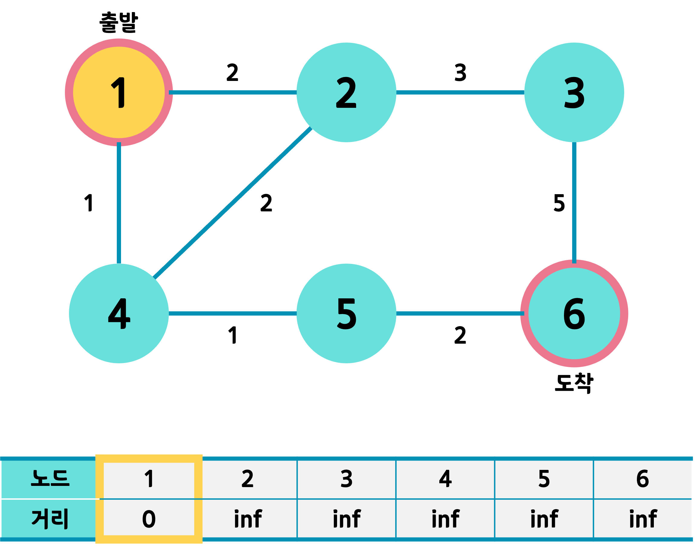
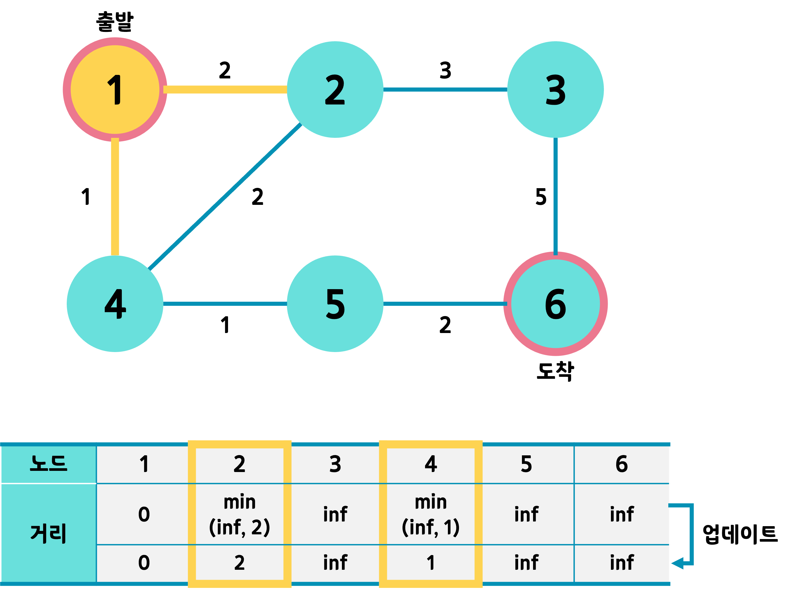
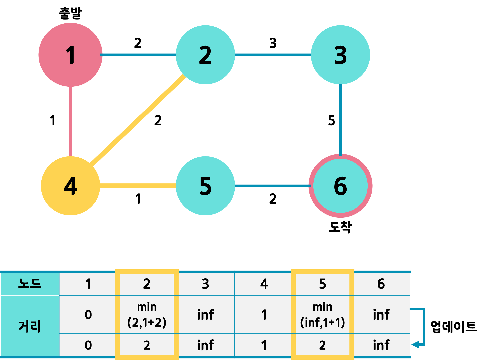
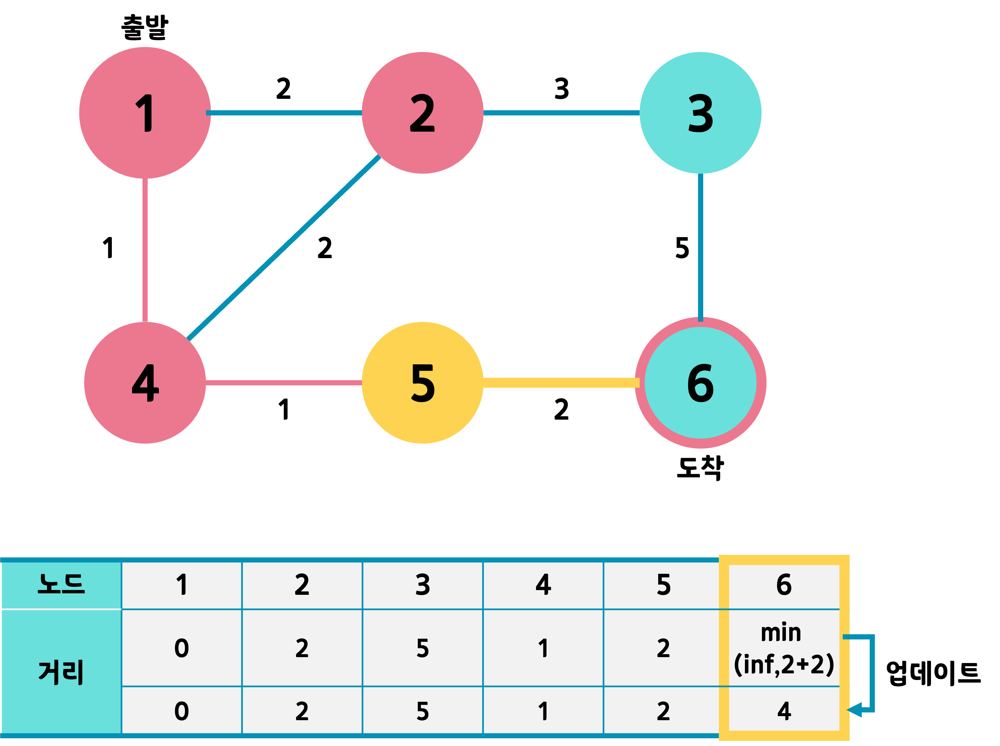

# 다익스트라(dijkstra) 알고리즘
 다익스트라 알고리즘은 가중치가 있는 그래프에서 한 노드에서 다른 모든 노드의 최단 거리를 구하는 알고리즘이다. 우선순위 큐를 사용하여 효율적인 동작이 가능하다.

## 동작 원리
1. 초기화
    - 시작 정점에서 각 정점까지의 거리를 무한(INF)으로 설정합니다.
    - 시작 정점의 거리는 0으로 설정합니다.
    - 우선순위 큐(priority queue, 최소 힙)를 사용하여 현재 방문할 정점을 관리합니다.
2. 가장 가까운 정점 선택
    - 우선순위 큐에서 현재까지의 최단 거리가 가장 짧은 정점을 꺼냅니다.
3. 인접한 정점 업데이트
    - 해당 정점의 인접한 정점들을 확인하며 더 짧은 경로가 있다면 갱신합니다.
    - (현재 정점까지의 최단 거리) + (현재 정점 → 인접 정점 거리)를 계산하여 기존보다 짧으면 갱신 후 큐에 삽입합니다.
4. 모든 정점을 처리할 때까지 반복

## 시간복잡도
우선순위 큐를 사용한 다익스트라는 다음과 같은 연산을 수행한다.
1. 각 노드에 대한 초기화 작업 → O(V)
    - dist 배열을 INF로 초기화.
    - 입력을 받아 인접 리스트(graph)를 구성.
2. 우선순위 큐에 시작 정점을 삽입 → O(log V)
    - 시작 정점에서 출발하는 간선만 고려.
3. 우선순위 큐에서 노드를 꺼내는 연산 → O(V log V)
    - V개의 노드를 각각 한 번씩 꺼내므로 O(V log V).
    - (최소 힙에서 요소를 꺼내는 연산: O(log V))
4. 각 노드에서 인접 노드를 확인하고 거리 갱신 → O(E log V)
    - 모든 간선을 확인해야 하므로 O(E).
    - 각 갱신마다 새로운 거리를 우선순위 큐에 삽입(O(log V)) 하므로 O(E log V).

## 예시
1. 출발 노드인 1번을 선택하고 자신과의 최단 거리를 0, 나머지 모든 노드의 최단거리를 무한대로 초기화


2. 우선순위 큐에서 현재 노드인 1번 선택 후, 인접한 노드와 거리 갱신


3. 우선순위 큐에서 다음 노드인 4번 선택 후, 인접한 노드와 거리 갱신


4. 우선순위 큐에서 다음 노드인 2번 선택 후, 인접한 노드와 거리 갱신


5. 우선순위 큐에서 다음 노드인 5번 선택 후, 인접한 노드와 거리 갱신


6. 우선순위 큐에서 다음 노드인 6번 선택. 도착 노드이며 알고리즘을 종료한다. 3번은 방문하지 않는다.


## 예제 코드
```C++
#include <iostream>
#include <vector>
#include <queue>
using namespace std;

#define INF 1e9 // 무한대 값 설정

// 그래프를 저장하는 인접 리스트 (비용, 연결 노드)
vector<pair<int, int>> graph[100001];
vector<int> dist(100001, INF); // 최단 거리 테이블 초기화

// 다익스트라 알고리즘 함수
void dijkstra(int start) {
    // 최소 힙(우선순위 큐) 선언 - (최단 거리, 노드 번호) 형태
    priority_queue<pair<int, int>, vector<pair<int, int>>, greater<>> pq;
    
    pq.push({0, start}); // 시작 노드의 거리는 0
    dist[start] = 0;

    while (!pq.empty()) {
        auto [cost, now] = pq.top(); // 현재 노드와 비용
        pq.pop();

        // 이미 처리된 노드라면 무시
        if (dist[now] < cost) continue;

        // 현재 노드와 연결된 다른 노드 확인
        for (auto [nextCost, next] : graph[now]) {
            int newDist = cost + nextCost; // 새로운 거리 계산
            
            // 더 짧은 경로를 발견하면 갱신
            if (newDist < dist[next]) {
                dist[next] = newDist;
                pq.push({newDist, next});
            }
        }
    }
}

int main() {
    int V, E, start;
    cin >> V >> E >> start; // 정점, 간선 개수, 시작 노드 입력

    // 그래프 입력 받기
    for (int i = 0; i < E; i++) {
        int u, v, w;
        cin >> u >> v >> w; // 시작점, 도착점, 가중치
        graph[u].push_back({w, v});
    }

    // 다익스트라 실행
    dijkstra(start);

    // 결과 출력
    for (int i = 1; i <= V; i++) {
        if (dist[i] == INF) cout << "INF\n"; // 도달할 수 없는 경우
        else cout << dist[i] << '\n';
    }
}
```

# 참고 링크
- [다익스트라 알고리즘 velog](https://velog.io/@717lumos/알고리즘-다익스트라Dijkstra-알고리즘)
- [동적계획법(Dynamic Programming) velog](https://velog.io/@boyeon_jeong/동적계획법Dynamic-Programming)
- [다익스트라 알고리즘 나무위키](https://namu.wiki/w/다익스트라%20알고리즘)