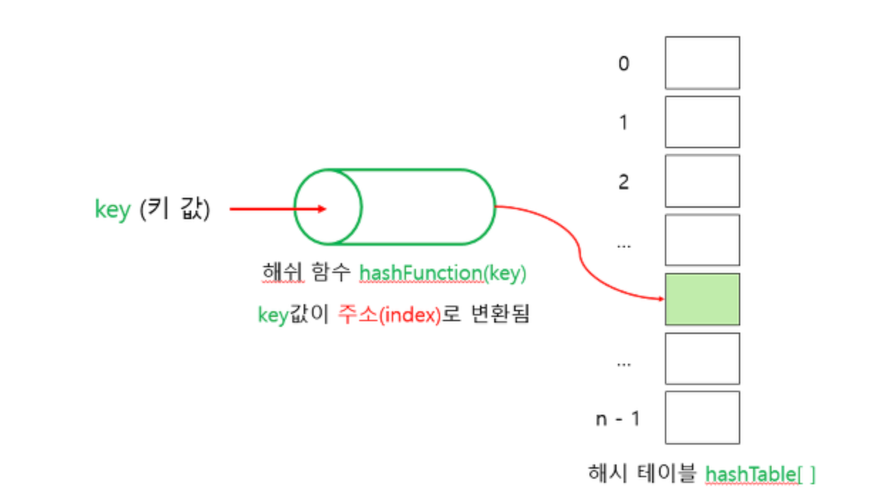

# 해싱(**Hashing**)이란?

해싱(Hashing)은 **입력값에 수학적 알고리즘(해시 함수)을 적용하여 고정된 크기의 문자열을 출력**하는 과정

출력된 문자열은 무작위적으로 보이고 보통 16진수의 형식

입력값의 크기와 상관없이 해시라고 부르는 출력값은 항상 알고리즘에 정의된 고정 길이로 출력된다.

해싱은 주로 컴퓨터 과학에서 데이터 무결성, 효율적인 데이터 관리를 위해 사용된다.
   
# 해싱의 구조

만약 어떤 회사의 직원이 100명이라면 직원들은 0에서 99까지의 아이디를 부여받는다. 탐색을 하려면 단순히 크기가 100인 배열을 만들면 된다. 자료를 저장하거나 탐색하려면 직원의 아이디를 키(배열의 인덱스)로 생각하고 단지 배열의 특정 요소를 일거나 쓰면 된다. 이런 연산의 시간 복잡도는 O(1)이다.

그러나 현실적으로는 탐색 키들이 문자열이거나 매우 큰 숫자이기 때문에 탐색 키를 직접 배열의 인덱스로 사용하기에는 무리가 있으므로 각 탐색 키를 작은 정수로 사상(mapping)시키는 어떤 함수가 필요하다. 해싱에서는 자료를 저장하는데 배열을 사용한다.

  
# 해시함수

- 입력값
    - 메시지라고 부름. 입력값으로는 다양한 길이와 형태의 데이터가 사용돼요. 단일 문자, 음악 파일, 메시지뿐만 아니라 복잡한 데이터 구조도 입력할 수 있다
    
- 해시함수
    - 해시 함수는 입력값을 고정된 크기의 블록으로 나눈 다음에 수학적 연산을 적용해서 최종 해시를 출력해요. 해시 함수는 주어진 입력에 대해 항상 동일한 해시를 생성하고, 입력 데이터가 조금이라도 바뀌어도 출력값은 크게 달라집니다.
    - 좋은 해시 함수는 효율적이고 다른 입력이 동일한 해시를 생성하는 것을 거의 불가능하게 합니다. 이런 특성 때문에 해시를 데이터 비교 및 무결성에 안전하게 사용할 수 있어요.
    
    [해시 함수 예시]
    
    - **SHA (Secure Hash Algorithm)**: SHA-1 (구버전), SHA-256, SHA-3 등 다양한 길이의 해시를 제공하며, 보안용이나 블록체인에 주로 사용됩니다.
    - **MD5 (Message Digest Algorithm 5)**: 데이터 무결성 검사에 사용되지만, 보안이 중요한 용도로는 권장되지 않아요.

- 출력값
    - 해시 or 다이제스트라고 함
    - 각 입력값에 고유한 출력값이 생성되기 때문에 지문과 비슷하다고 생각할 수 있음
    - 출력값의 길이는 해시 함수에 따라 달라집니다. 예를 들어 SHA-256 해시 함수는 항상 265비트의 출력값을 생성한다.
    - 해싱은 암호화와 달리 출력값을 원본 입력값으로 복호화할 수 없어요. 출력값은 항상 고정된 길이의 문자열을 출력하기 때문에 입력 데이터가 손실돼요. 출력값과 해싱 함수를 안다고 해도 대응하는 입력값을 찾는 것은 어려워요.
    
 
# 해시테이블

해시 테이블은 **연관 배열구조**를 이용하여 데이터를 Key와 Value로 저장하는 자료구조이다.

해시 테이블은 해시 함수를 사용하여 색인(index)을 버킷(bucket)이나 슬롯(slot)의 배열로 계산한다.
 
# 장점

- 중복을 제거할 수 있다
- 데이터 캐싱, 보안에 주로 사용
- 배열의 인덱스로 접근하기 때문에 삽입,삭제등의 연산이 빠르다
 
# 단점

- 공간복잡도가 커진다
- 충돌이 발생할 수 있다.
    - 충돌이 발생할 경우 시간 복잡도는 O(n)에 가까워진다.
- 순서가 있는 배열에는 어울리지 않음

### 출처

---

https://docs.tosspayments.com/resources/glossary/hashing

https://devlog-wjdrbs96.tistory.com/50

[https://velog.io/@hanif/자료구조-해시](https://velog.io/@hanif/%EC%9E%90%EB%A3%8C%EA%B5%AC%EC%A1%B0-%ED%95%B4%EC%8B%9C)