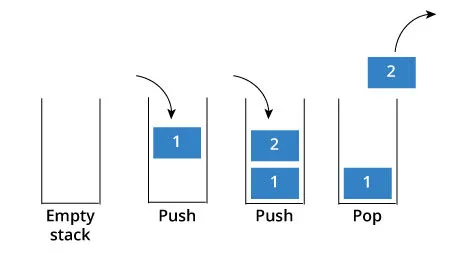
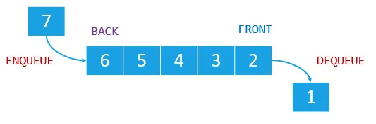

# 스택 & 큐

데이터가 저장된 순서에 따라 데이터를 읽어올 수 있는 자료 구조

## **스택(Stack)**

- LIFO(Last In, First Out)
- 새로운 데이터를 맨위에 추가하고 맨 위의 원소부터 제거한다.
    - 1 → 2→ 3→ 4
        
        ⇒ 4 → 3 → 2→ 1
        
- **기본 연산**
    - `enqueue`: 데이터를 스택에 삽입
    - `dequeue`: 스택의 맨 위에서 데이터를 제거하고 반환
    
- **활용 사례**
    - 함수 호출과 반환(콜 스택)
    - 실행 취소
    - 웹 브라우저의 뒤로 가기/앞으로 가기
    - 깊이 우선 탐색(DFS)
    
    ### 깊이 우선 탐색
    
    막다른 골목에 도달할 때까지 한 경로로 진행한다. 마지막 골목에서는 이전 분기로 돌아가 다음 경로로 진행할 수 있는지 확인한다. 깊이 우선 탐색은 스택을 사용해 앞으로 탐색해야 할 목록을 유지하고, 다음 진행 대상으로 최근에 삽입된 경로를 선택한다.
    

    

## **큐(Queue)**

- **정의**: FIFO(First In, First Out)
- 먼저 들어간 데이터가 가장 먼저 제거된다.
    - 1 → 2→ 3→ 4
        
        ⇒  1 → 2→ 3→ 4
        
- **기본 연산**:
    - `enqueue`: 데이터를 큐에 삽입
    - `dequeue`: 큐에서 맨 앞의 데이터를 제거.
    
- **활용 사례**
    - 프로세스 스케줄링
    - 프린터 작업 대기열
    - 네트워크 패킷 처리
    - 너비 우선 탐색(BFS)
    
    ### 너비 우선 탐색
    
    큐를 이용해 각 단계에서 가장 오래 기다린 경로를 탐색한다. 더 깊이 들어가기 전에 같은 깊이의 여러 방향을 먼저 탐색한다. 
    
    
    

## **변형된 구조**

### **원형 큐 (Circular Queue)**

- 배열 기반 큐는 데이터가 추가/삭제되면서 사용되지 않는 공간이 생기는데(메모리 낭비) 원형 큐는 이를 개선하기 위해 배열을 순환 구조로 연결한다.
- 큐의 끝에 도달하면 다시 배열의 처음으로 돌아가 작업을 수행한다.
- 고정된 크기로도 메모리 효율이 높다.
- 활용
    - 네트워크 버퍼

empty

- 삽입과 삭제는 `(index + 1) % size`를 이용한다.

### **우선순위 큐 (Priority Queue)**

- 데이터가 삽입될 때 특정 우선순위를 기준으로 정렬된다.
- 제일 높은 우선순위의 데이터를 가장 먼저 처리한다.
- 활용
    - 운영 체제의 프로세스 스케줄링.
    - 네트워크 패킷 전송.

### **이중 끝 큐 (Deque, Double-ended Queue)**

- 양쪽에서 삽입과 삭제가 가능한 큐
- 큐와 스택의 역할을 모두 수행 가능해 유연한 데이터 처리가 가능하다.

| 변형 구조 | 특징 | 활용 사례 |
| --- | --- | --- |
| 원형 큐 | 순환 배열 기반 큐 | 네트워크 버퍼 |
| 우선순위 큐 | 우선순위 기반 데이터 처리 | 프로세스 스케줄링, 네트워크 패킷 전송 |
| 데크 | 양쪽에서 삽입/삭제 가능 | 브라우저, 슬라이딩 윈도우 |

https://devuna.tistory.com/22

https://medium.com/swlh/stacks-and-queues-simplified-ef0f838fc534

https://www.programiz.com/java-programming/queue

[원형 큐](https://mengu.tistory.com/110)

[우선순위 큐](https://lipcoder.tistory.com/100)