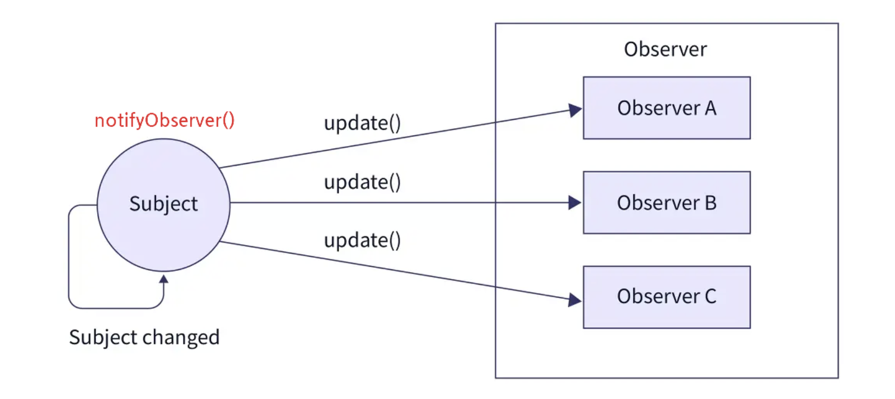
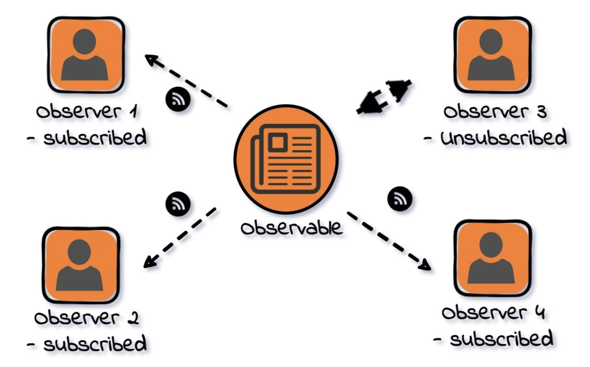

## 정의

옵저버 패턴은 객체의 상태 변화를 관찰하는 관찰자들 , 즉 옵저버들의 목록을 객체에 등록하여 상태 변화가 있을 때마다 메서드 등을 통해 객체가 직접 목록의 각 옵저버에게 통지하도록 하는 디자인패턴.

쉽게 말해 어떤 객체의 상태가 변할 때 그와 연관된 객체들에게 알림을 보내는 디자인 패턴

**Observer(관찰자)**

상태 변화를 감지하는 대상이다.

옵저버에는 함수나 객체 모두 등록이 가능하다.

**Obervable(객체)**

상태가 변경되는 대상이다.

subscribe, unsubscribe, notify 등 행동을 처리하는 메서드를 보유하고 있어야 한다.

---

## 특징

- 옵저버 패턴은 다른 디자인패턴들과 다르게 일대 다 의 의존성을 가진다.
- 주로 분산 이벤트 핸들링 시스템을 구현하는데 사용된다.
- 옵저버 패턴의 핵심은 의존성을 낮추는 것(결합도를 낮추는 것)이다.

---

## 옵저버 패턴 흐름

1. 한개의 관찰 대상자와 여러개의 관찰자로 일대 다 관계로 구성되어있다.
2. 옵저버 패턴에서는 관찰 대상의 상태가 바뀌면 변경사항을 옵저버 한테 통보해준다.
3. 대상자로부터 통보를 받은 옵저버는 값을 바꿀수도 있고, 삭제하는등 적절히 대응한다.
4. 옵저버들은 언제든 대상자의 그룹에서 추가/삭제 될 수 있다. 관찰 대상 그룹에 추가되면 관찰 대상자로부터 정보를 전달받게 될 것 이며, 그룹에서 삭제될경우 더이상 관찰 대상자의 정보를 받을 수 없게 된다.



---

## 예시

유튜브 채널 → 발행자(**Obervable**)

구독자 → 관찰자(**Observer**)

유튜버가 영상을 올라면 여러명의 구독자들은 모두 영상이 올라왔다는 알림을 받는다.

이를 패턴구조로 보면, 구독자들은 해당 채널을 구독함으로써 채널에 어떠한 변화가 생기게 되면 바로 연락을 받아 탐지하는 것. 반면 구독을 해지하거나 안한 시청자들에게는 알림이 가지 않는다.



---

## 예시 코드

만약 Youtube라는 객체와 Tom, Jane, James라는 옵저버 객체가 있다면

```jsx
//**Obervable ::** 구독, 구독취소, 알림 메서드를 정의
class Youtube{ 
	constructor(){
    	this.observer=[];
    }
    
    subscribe(observer){
    	this.observer.push(observer);
    }
    unsubscribe(observer){
    	this.observer = this.observer.filter(obs => obs !== observer);
    }
    notifySubscriber(data){
    	this.observer.forEach(obs => obs.update(data));
    }
}

//**Observer :: Obervable이 알림 메서드를 활용할 때, 알림을 받고 개별 동작을 수행할 수 있는 메서드를 정의**
class Observer{
	update(data){
    	...
    	//Jane 클래스가 구독한 옵저버블의 상태변화가 일어났을 때 행동해야 할 로직
    }
}

class Jane extends Observer{
}
```