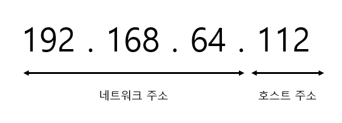
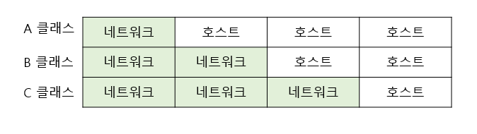
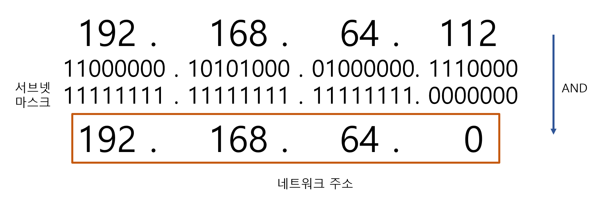
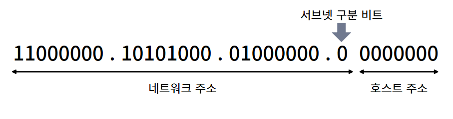

## 1. IP의 정의와 역할

### IP(Internet Protocol)

- IP는 네트워크 계층에서 데이터를 라우팅하는 기본 프로토콜이다.
- 인터넷에 연결되어 있는 모든 장치들을 식별할 수 있도록 각각의 장비에게 부여되는 고유 주소로 데이터 패킷이 출발지에서 목적지까지 올바르게 전달되도록 네트워크에서 호스트를 고유하게 식별한다.

### 역할

- 패킷 주소 지정
- 네트워크 간 데이터 전달 경로 결정

### 특징

- 사용자가 변경 가능한 논리 주소이다.
- 그룹을 의미하는 네트워크 주소와 호스트 주소로 나뉜다.
- IP 주소는 32비트로 구성되며, 각 8비트 단위를 **옥텟**이라고 한다.

## 2. IP 주소 체계

|  | **IPv4** | **IPv6** |
| --- | --- | --- |
| **비트 수** | 32비트 | 128비트 |
| **주소 형식** | 4개의 십진수(0~255) | 8개의 16진수 블록 |
| **주소 공간** | 약 43억 개 | 3.4×10³⁸개 |
| **예시** | 192.168.0.1 | 2001:0db8:85a3:0000:0000:8a2e:0370:7334 |

## 3. IP 주소의 구성

### IP =  네트워크 주소 + 호스트 주소

- **네트워크 주소**
    - **네트워크를 구분하는 주소**로, 같은 네트워크 안에 있는 장치들은 동일한 네트워크 주소를 가진다.
    - 네트워크 주소가 같으면 로컬 네트워크로 간주한다.
    - 주소(서울 서초구 내곡동)
- **호스트 주소**
    - 네트워크 내 **개별 장치를 식별하는 주소**이다.
    - 하나의 네트워크 안에서 각 호스트를 고유하게 구분한다.
    - 상세주소 (1-749)

**IP 주소: 192.168.64.112**

- **네트워크 부분**: `192.168.0` (2진수: `11000000.10101000.0000000`)
- **호스트 부분**: `112` (2진수: `01110000`)

### 나눠지는 이유

네트워크가 효율적으로 작동할 수 있도록 라우터는  정보 패킷이 대상으로 하는 호스트의 네트워크만 알고있다.  라우팅 테이블에 저장된 정보를 사용하여 **패킷을 대상 호스트의 네트워크로 전달한 후  호스트로 전달**된다. 이 프로세스가 작동하기 위해 IP는 네트워크가 호스트 두 부분으로 구성된다.

## 4. IP 주소 클래스

네트워크와 호스트 주소를 구분하는 부분은 고정되어 있지 않다. 필요한 호스트 IP 개수에 따라 네트워크의 크기를 다르게 할당할 수 있는 클래스 개념을 도입했다.

### 클래스 기반 주소 체계 (Classful Addressing)

- 필요에 따라 네트워크를 크게 혹은 작게 나누어 IP를 할당한다.
- 주소의 맨 앞 숫자를 보고 해당 주소가 어떤 클래스에 속했는지 알 수 있다.

| 클래스 | 시작 주소 | 끝 주소 | 특성 |  |
| --- | --- | --- | --- | --- |
| A | 1.0.0.0 | 126.255.255.255 | 대규모 네트워크 | 약 1,600만 개 |
| B | 128.0.0.0 | 191.255.255.255 | 중규모 네트워크 | 약 6만 5천 개 |
| C | 192.0.0.0 | 223.255.255.255 | 소규모 네트워크 | 약 250개 |

클래스풀에서는 한 개의 클래스 네트워크가 한 조직에 할당되면 비어 있는 주소라도 IP를 분할해 다른 기관이 사용할 수 없다. 상위 클래스를 할당받은 조직이 이 주소들을 제대로 사용하지 못하면 주소 낭비가 발생할 수 있다. 

👉 **클래스리스 주소 체계 (CIDR, Classless Inter-Domain Routing)** 등장

### 클래스리스 주소 체계 (CIDR, C**lassless Inter-Domain Routing**)

- 현대 인터넷의 주소 체계
- 클래스가 존재하지 않는 도메인간 라우팅 기법
- 네트워크 주소와 호스트 주소를 1비트 단위로 세밀하게 구분해 필요한 만큼 할당할 수 있다.
- **서브넷 마스크**를 네트워크와 호스트 주소를 나누는 구분자로 사용한다.

| **구분** | **클래스풀(Classful)** | **클래스리스(CIDR)** |
| --- | --- | --- |
| **유연성** | 고정된 네트워크/호스트 비율 | 가변적인 네트워크 크기 |
| **주소 낭비 문제** | 발생 | 최소화 |
| **서브넷 지원** | 제한적 | 서브네팅 필수 요소 |

## 5. 서브넷 마스크

- **서브넷**을 구분하는 방법 중 하나
- 네트워크 주소와 호스트 주소를 구분하는 데 사용되는 32비트 숫자
    - 1이 연속된 부분 = 네트워크 주소
    - 0이 있는 자리 = 호스트 주소
- 주소에서 서브넷 마스크 값을 가지고 비트 and 연산을 해서 네트워크 아이디가 나와 일치 한다면 우리 네트워크로 유입되는 것으로 확인

### 네트워크 주소 계산법

- IP 주소: `192.168.64.112`
- 서브넷 마스크: `255.255.255.0`
    - **네트워크 주소**: `192.168.64.0`
    - **호스트 주소**: `0.0.0.112`

### 프리픽스(prefix)

- 서브넷마스크를 표기하는 방법으로 네트워크 ID의 개수를 표기한다.
- `192.168.64.112/24`
    - 서브넷 마스크: `255.255.255.0`
    - 프리픽스 표기법: `/24`
        - 처음 24비트가 네트워크 주소를 나타낸다.

## 6. 서브네팅

 IP주소를 효율적으로 나누어 사용하기 위해 네트워크-호스트 구분 기준을 사용자가 정해 원래 클래스 단위보다 잘게 쪼개는 것을 서브네팅이라고 한다.

**기본 네트워크**: `192.168.64.112/24`

- 256개의 호스트 주소 지원.

**서브네팅 후** (`/25`로 분할 시)
    

    
- 총 서브넷 수: 2개
- 서브넷 마스크 = `255.255.255.128`
- 서브넷 범위
    
    
    | **서브넷 번호** | **네트워크 주소** | 
    | --- | --- |
    | 서브넷 1 | `192.168.64.0`
    192.168.64. **0** 0000000 ~ **0** 1111111 | `192.168.64.1 ~ 192.168.64.126` |
    | 서브넷 2 | `192.168.64.128`
    192.168.64. **1** 0000000 ~ **1** 1111111 | `192.168.64.129 ~ 192.168.64.254` |

## 7. IP 주소 할당 방식

### 고정 IP

- 사용자가 수동으로 설정한 변하지 않는 IP 주소
- 항상 동일한 주소를 사용하기 때문에 외부에서 접근이 필요한 경우 적합하다.
- 예: 서버, 네트워크 장비(라우터, 프린터)

### 동적 IP

- DHCP(Dynamic Host Configuration Protocol) 서버에 의해 자동 할당되는 IP 주소
- 일정 시간이 지나면 IP 주소가 변경될 수 있다.
- 사용하지 않는 IP는 재활용하여 낭비를 방지할 수 있다.
- 예: 일반 사용자 장치(PC, 스마트폰, 태블릿), 공공 네트워크

| **특징** | **고정 IP** | **동적 IP** |
| --- | --- | --- |
| **설정 방식** | 수동으로 설정 | DHCP 서버에 의해 자동 할당 |
| **변경 여부** | 변하지 않음 | 임대 기간 만료 시 변경 가능 |
| **유지 비용** | 비교적 높음 | 비용 절감 가능 |
| **주요 사용처** | 서버, 네트워크 장비 | 사용자 장치, 공공 네트워크 |
| **관리 용이성** | 관리가 복잡할 수 있음 | 자동화되어 간편 |
- **DHCP 서버가 없는 경우의 문제점**
    - 모든 장치에 수동으로 고정 IP를 설정해야 한다.
    - 설정 오류 발생 가능성이 높고, 관리가 복잡해진다.
    
    동적 IP의 장점은 **효율성**과 **관리 용이성**에 있으며, 고정 IP는 **안정성**과 **외부 접근성**이 좋다.
    

### 공인 IP

- 전 세계에서 유일한 IP
    - 내/외부 상관없이 해당 IP에 접속할 수 있다.
- CANN에서 국가별로 사용할 IP 대역을 관리한다.  우리나라는 한국인터넷진흥원(KISA)에서 국내 IP 주소들을 관리하고 있다.
- 통신업체(ISP, Internet Service Provider)가 IP를 부여받고 사람들은 가입을 통해 통신업체로부터  IP제공받아 인터넷을 사용한다. 이렇게 발급받은 IP가 공인 IP 이다.

### 사설 IP

- 하나의 네트워크 안에서 유일한 IP
    - 내부에서만 접근할 수 있다.
- 내부 네트워크에서 사용되는 주소로, 인터넷에 직접 연결되지 않는다.
    - 공유기까지 → 공인 IP
    - 공유기에 연결되어 있는 기기 → 사설 IP 할당

| **구분** | **공인 IP** | **사설 IP** |
| --- | --- | --- |
| **범위** | 인터넷 전체에서 고유 | 로컬 네트워크 내에서 고유 |
| **접속 가능성** | 외부 네트워크에서 접근 가능 | 외부에서 직접 접근 불가 |

---

🍎

### 참고

https://docs.tosspayments.com/resources/glossary/ip

https://learn.microsoft.com/ko-kr/troubleshoot/windows-client/networking/tcpip-addressing-and-subnetting

https://www.cloudflare.com/ko-kr/learning/network-layer/what-is-a-subnet/

https://www.youtube.com/watch?v=b7Wk-6w5vgg

https://www.youtube.com/watch?v=-iMFsDdfoeI

 [**IT 엔지니어를 위한 네트워크 입문**](https://www.yes24.com/Product/Goods/93997435)
