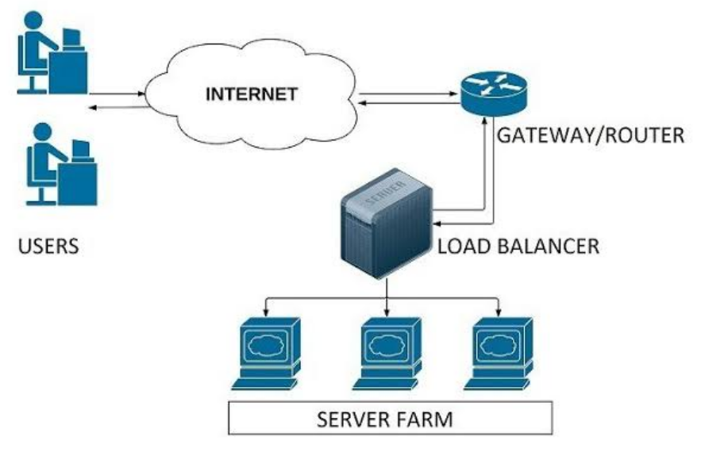
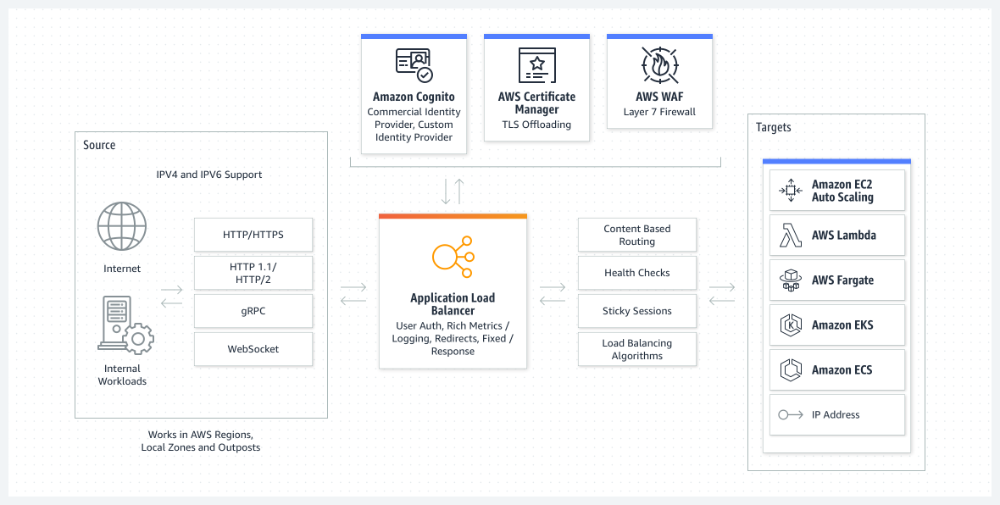
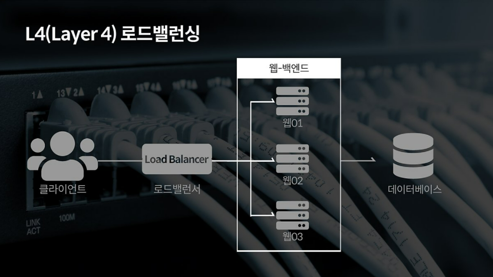
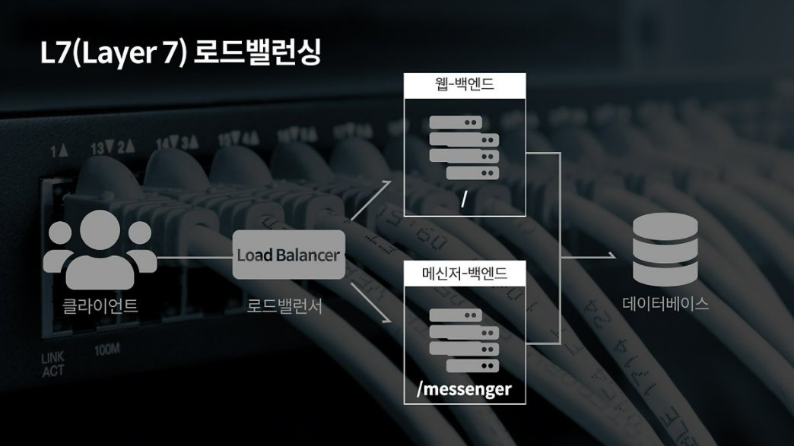
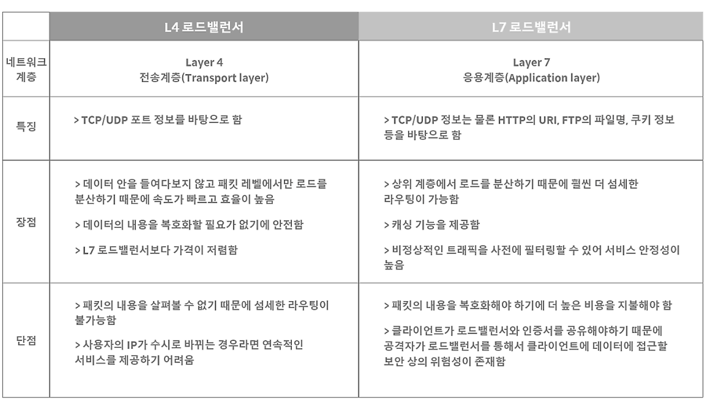

# 로드 밸런싱이란?

애플리케이션을 지원하는 리소스 풀 전체에 네트워크 트래픽을 균등하게 배포하는 방법이다. 최신 애플리케이션은 수백만 명의 사용자를 동시에 처리하고 정확한 텍스트, 비디오, 이미지 및 기타 데이터를 빠르고 안정적으로 반환해야 한다. 이를 위해 데이터가 중복되는 리소스 서버가 많고, **로드 밸런서**는 사용자와 서버 그룹 사이에서 **보이지 않는 촉진자** 역할을 한다.

"한 놈(한 서버)이 일을 다 처리하면 부담스러우니, 여러 놈(여러 서버)한테 일을 나누겠다!"

---

## 로드 밸런싱의 이점

로드 밸런싱은 애플리케이션 서버와 방문자 또는 클라이언트 간의 인터넷 트래픽을 지시하고 제어한다.  

결과적으로 **애플리케이션의 가용성, 확장성, 보안 및 성능이 향상**됨.  

---

### 애플리케이션 가용성

서버 장애 또는 유지 관리로 인해 애플리케이션 가동 중지 시간이 늘어 방문자가 애플리케이션을 사용할 수 없을 수 있음.  

로드 밸런서는 **서버 문제를 자동으로 감지하고** 클라이언트 트래픽을 사용 가능한 서버로 리디렉션하여 시스템의 **내결함성을 높인다**.  

로드 밸런싱을 사용하여 다음 태스크를 더 쉽게 수행할 수 있음:  
- 애플리케이션 **가동 중지 없이 유지 관리** 또는 업그레이드 실행  
- 백업 사이트에 **자동 재해 복구** 제공  
- **상태 확인**을 수행하고 가동 중지를 유발할 수 있는 문제 방지  

---

### 애플리케이션 확장성

로드 밸런서를 사용하여 여러 서버 간에 **네트워크 트래픽을 지능적으로 전달**할 수 있다.  

로드 밸런싱이 다음을 수행하므로 애플리케이션에서 **수천 개의 클라이언트 요청을 처리**할 수 있다:  
- 한 서버에서 **트래픽 병목 현상** 방지  
- 필요한 경우 **서버를 추가/제거**할 수 있도록 애플리케이션 트래픽을 예측  
- 안심하고 조정할 수 있도록 시스템에 **중복성**을 추가  

---

### 애플리케이션 보안

로드 밸런서에는 인터넷 애플리케이션에 또 다른 **보안 계층**을 추가할 수 있는 보안 기능이 내장되어 있다.  

이는 공격자가 서버 장애를 일으키는 **수백만 개의 동시 요청**으로 애플리케이션 서버를 가득 채우는 **DDoS 공격**을 처리하는 데 유용한 도구다.  

로드 밸런서는 다음을 수행할 수도 있다:  
- **트래픽 모니터링** 및 악성 콘텐츠 차단  
- 공격 트래픽을 여러 백엔드 서버로 **자동으로 리디렉션**하여 영향 최소화  
- 추가 보안을 위해 **네트워크 방화벽 그룹**을 통해 트래픽 라우팅  

---

## 로드 밸런싱의 기본 기능

### Health Check (상태 확인)
- 서버들에 대한 주기적인 Health Check를 통해 서버들의 장애 여부를 판단하여, 정상 동작 중인 서버로만 트래픽을 보낸다.
- **L3 체크**: *ICMP를 이용하여 서버의 IP 주소가 통신 가능한 상태인지를 확인한다.
- **L4 체크**: TCP는 3 Way-Handshaking (전송 - 확인/전송 - 확인)을 기반으로 통신하는데, 이러한 TCP의 특성을 바탕으로 각 포트 상태를 체크하는 방식.
- **L7 체크**: 어플리케이션 계층에서 체크를 수행. 실제 웹페이지에 통신을 시도하여 이상 유무를 파악.

---

### Tunneling (터널링)
- 데이터 스트림을 인터넷 상에서 가상의 파이프를 통해 전달시키는 기술로, 패킷 내에 터널링할 대상을 캡슐화시켜 목적지까지 전송.
- 연결된 상호 간에만 캡슐화된 패킷을 구별해 캡슐화를 해제하게 함.

---

### NAT (Network Address Translation)
- 내부 네트워크에서 사용하는 사설 IP 주소와 로드밸런서 외부의 공인 IP 주소 간의 변환 역할.
- 로드밸런싱 관점에서는 여러 개의 호스트가 하나의 공인 IP 주소(VLAN or VIP)를 통해 접속하는 것이 주 목적.
- **SNAT (Source Network Address Translation)**: 내부에서 외부로 트래픽이 나가는 경우.  
  내부 사설 IP 주소 -> 외부 공인 IP 주소로 변환.
- **DNAT (Destination Network Address Translation)**: 외부에서 내부로 트래픽이 들어오는 경우.  
  외부 공인 IP 주소 -> 내부 사설 IP 주소로 변환.

---

### DSR (Destination Network Address Translation)
- 서버에서 클라이언트로 트래픽이 되돌아가는 경우, 목적지를 클라이언트로 설정한 다음, 네트워크 장비나 로드밸런서를 거치지 않고 바로 클라이언트를 찾아가는 방식.
- 이 기능을 통해 로드밸런서의 부하를 줄여줄 수 있음.

---

## 로드 밸런싱 알고리즘
로드 밸런서가 서로 다른 클라이언트 요청 각각에 가장 적합한 서버를 결정하기 위해 따르는 규칙 세트이다. 크게 2가지 범주로 나뉨(정적,동적)

### 정적 로드 밸런싱
- 사전 정의된 규칙을 기반으로 트래픽을 분산, 로드밸런서가 시스템 시작 시점에서 서버 간의 부하를 미리 계산하거나 설정해 둔 기준에 따라 작업을 분배

1. **라운드 로빈**: 순서대로 요청 할당  
2. **가중치 라운드 로빈**: 성능에 따라 더 많은 트래픽 할당  
3. **IP 해시**: 클라이언트 IP를 해싱해 동일 서버로 연결  

### 동적 로드 밸런싱
- 실시간으로 서버 상태와 부하를 모니터링하고 이를 기반으로 작업을 분산, 각 서버의 현재 성능과 부하 상황에 따라 로드밸런서가 적절한 서버를 선택함

1. **최소 연결**: 활성 연결 수가 적은 서버로 분배  
2. **최소 응답 시간**: 가장 빠른 서버에 요청  
3. **가중치 최소 연결**: 성능 가중치와 연결 수를 고려  
4. **자원 기반**: CPU, 메모리 사용률 등을 분석해 최적의 서버 선택  

| 구분               | 정적 로드 밸런싱           | 동적 로드 밸런싱               |
|--------------------|------------------------|-----------------------------|
| **기준**           | 사전 정의된 규칙         | 실시간 서버 상태와 부하 고려     |
| **복잡도**         | 낮음                   | 높음                        |
| **유연성**         | 낮음                   | 높음                        |
| **오버헤드**       | 적음                   | 많음 (실시간 모니터링 필요)      |
| **사용 예시**       | 단순한 트래픽 분산        | 대규모 시스템, 실시간 부하 변화 |

---

## 로드 밸런싱의 작동 방법

회사는 일반적으로 여러 서버에서 애플리케이션을 실행한다. 이러한 서버 배열을 서버 팜이라고 한다. 애플리케이션에 대한 사용자 요청은 먼저 로드 밸런서로 이동한다. 그런 다음 로드 밸런서는 요청을 처리하는데 가장 적합한 서버 팜의 단일 서버로 각 요청을 라우팅한다. 

로드 밸런싱은 레스토랑에서 관리자가 수행하는 작업과 같다. 5명의 웨이터가 있는 식당을 생각해보면, 고객이 웨이처를 선택할 수 있는 경우 한,두명의 웨이터는 업무에 과부하가 걸리고 나머지는 유휴 상태일 수 있다. 이러한 경우가 발생하지 않도록 레스토랑 관리자는 고객에게 가장 적합한 특정 웨이터에게 고객을 할당한다.

---

## L4 로드 밸런서
: 4 계층 - 네트워크 계층(IP, IPX)이나 3 계층 - 전송 계층(TCP, UDP) 의 정보를 바탕으로 로드를 분산.
  즉, IP 주소, 포트번호, MAC 주소, 전송 프로토콜 등에 따라 트래픽을 분산하는 것이 가능. 

## L7 로드 밸런서
: 7 계층 - 어플리케이션 계층(HTTP, FTP, SMTP 등)에서 로드를 분산하기 때문에, HTTP 헤더, 쿠키 등과 같은 사용자 요청을 기준으로 특정 서버에 트래픽을 분산하는 것이 가능.

