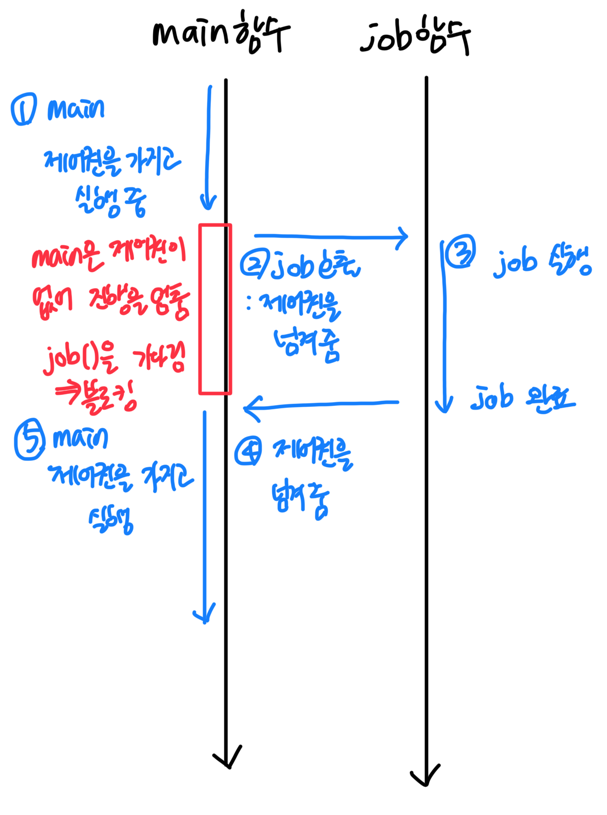
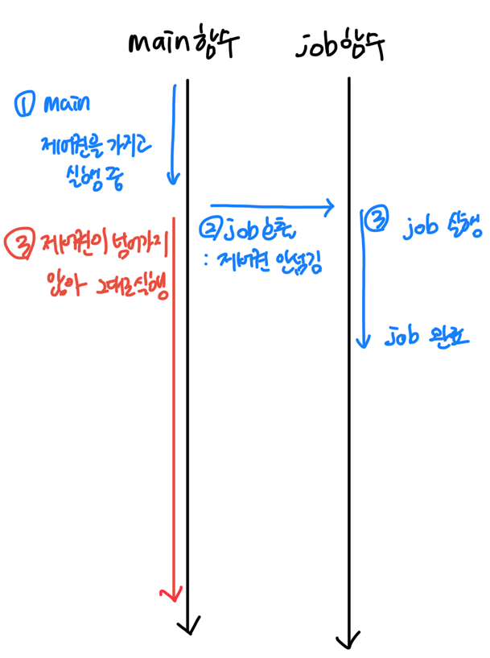
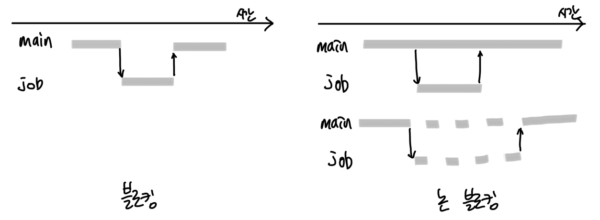
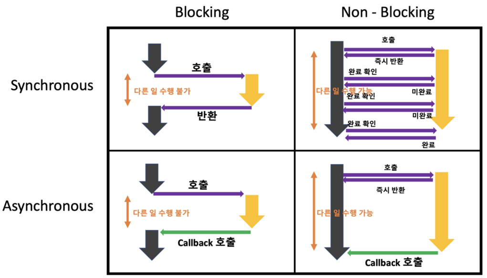

# 블로킹(Blocking)과 논블로킹(Non-Blocking)

블로킹(Blocking)
: 특정 작업이 끝날 때까지 대기하며, 다른 작업을 수행하지 못한다.

논블로킹(Non-Blocking)
: 작업을 수행하는 동안 대기하지 않고, 바로 다음 작업을 수행할 수 있다.

## 제어권으로 보는 의미 

### 블로킹

블로킹에서는 제어권의 소유가 변경된다.

main()이 제어권을 가지고 코드를 실행하던 중 job()을 호출했을 때, 
제어권이 job()으로 넘어가고, main()은 job()이 제어권을 가져갔기 때문에 main()의 실행이 멈춰지고 job()을 기다리게 된다. 
그리고 job()이 실행을 마치고 응답과 함께 main()에게 제어권을 넘겨주면 main()이 멈췄던 부분부터 다시 실행되는 것이다.

### 논블로킹

논블로킹에서는 제어권의 소유가 변경되지 않는다.

main()이 제어권을 가지고 코드를 실행하던 중 job()을 호출했을 때, 
제어권이 job()으로 넘어가지 않고, main()은 제어권이 있기 때문에 job()을 기다리지 않고, main()의 실행을 한다. 
그리고 job()의 실행이 끝나면 그대로 job()은 종료된다.

### 비교

블로킹에서는 job이 실행되는 동안 main이 실행 될 수 없지만, 논블로킹에서는 job이 실행되는동안 main이 실행 될 수 있다.
만약 멀티스레드 방식이라면 논블로킹의 위의 그림처럼 동작할 수 있고, 싱글스레드 방식이라면 아래의 그림처럼 동작할 수 있다.

## 동기와 비동기와 같이 보기

동기/비동기와 블로킹/논블로킹 개념들은 서로 반대되거나 하는 개념이 아니라, 작업에 대해 관점의 차이다.
이 작업의 처리 순서가 순차적이냐, 순차적이지 않냐 와 같은 순서에 대한 관점이라면 동기와 비동기 이고,
요청을 보내고 응답이 올 때까지 기다려야하냐, 아니면 기다리지 않아도 되냐와 같이 대기에 대한 관점이라면 블로킹과 논 블로킹인 것이다.
그래서 비동기라고 무조건 논 블로킹이 아니라 블로킹이 발생할 수 있다.

|     | 블로킹                                                                                | 논블로킹                                                                                   |
|-----|------------------------------------------------------------------------------------|----------------------------------------------------------------------------------------|
| 동기  | 순차적으로 블로킹되는 작업을 진행하기 때문에, 순서대로 작업이 끝나면 다음 작업을 진행함                                  | 논블로킹 작업이기 때문에 요청에 대한 응답은 바로 오지만, 작업이 언제 끝나는지 알 수 없어 중간마다 확인을 해야함                       |
| 비동기 | 비동기 호출이지만 내부 작업이 블로킹이라 결과가 올 때까지 기다려야 하며, 실제로는 다른 작업을 못 하고 정지되고 작업이 끝나야 다음 작업을 진행함 | 논블로킹 작업을 비동기로 실행하기 때문에, 호출 후 원래의 작업을 이어가다가 callback 함수를 통해 논블로킹 작업이 끝나면 끝난 것에 대한 알림을 받음 |

# 출처
- [Springboot Java - 비동기와 멀티스레팅](https://sujeong-0.github.io/posts/%EB%A9%80%ED%8B%B0%EC%8A%A4%EB%A0%88%EB%94%A9%EA%B3%BC-%EB%B9%84%EB%8F%99%EA%B8%B0/#spring%EC%97%90%EC%84%9C-%EB%B8%94%EB%A1%9C%ED%82%B9-%EB%85%BC%EB%B8%94%EB%A1%9C%ED%82%B9)
- [완벽히 이해하는 동기/비동기 & 블로킹/논블로킹](https://inpa.tistory.com/entry/%F0%9F%91%A9%E2%80%8D%F0%9F%92%BB-%EB%8F%99%EA%B8%B0%EB%B9%84%EB%8F%99%EA%B8%B0-%EB%B8%94%EB%A1%9C%ED%82%B9%EB%85%BC%EB%B8%94%EB%A1%9C%ED%82%B9-%EA%B0%9C%EB%85%90-%EC%A0%95%EB%A6%AC)
